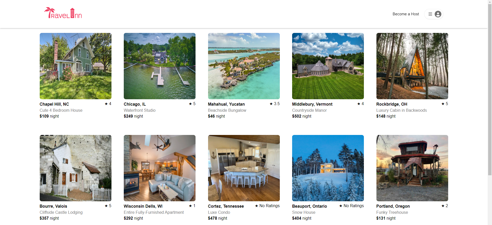

# Travel-Inn

Welcome to Travel-Inn! Travel-Inn is a full-stack travel site in the style of Airbnb built with the PERN stack.  Travel-Inn visitors are able to create a user account, or sign in with a single click using the Demo User. Once logged in, users can access full CRUD operations for listings, reviews and bookings.  Travel-Inn utilizes the Google Maps API to display approximated locations of each listing.

Travel-Inn remains a WIP and many more features (as well as plenty of polish) are yet to come.

[Click this link to check it out yourself!](https://travel-inn.onrender.com)

## Tech Stacks

### Language

### Libraries/Tools:

### Database/Hosting:

## Wiki Links

Please use the provided links below for further information on the project:

### [Feature List](https://github.com/ChristoGrab/AirBnB-Project/wiki/Feature-List)

### [Roadmap](https://github.com/ChristoGrab/AirBnB-Project/wiki/Roadmap)

### [Database Schema](https://github.com/ChristoGrab/AirBnB-Project/wiki/Database-Schema)

## Landing Page

From the landing page, you can see a display of all the listings currently on the site.

A Demo User button has been included so all features can be tested without having to register a new account.

## Contact Me

  

  
  
    
  
  

